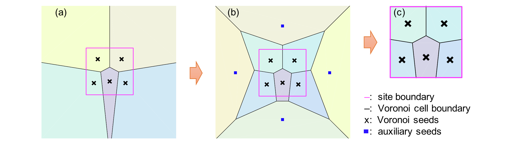

### 关于应用质心Voronoi曲面细分和随机场理论的场地调查程序优化

论文题为**On the optimization of site investigation programs using centroidal Voronoi tessellation and random field theory**（*关于应用质心Voronoi曲面细分和随机场理论的场地调查程序优化*），发表于期刊***Computers and Geotechnics***。*黄林冲教授*为第一作者，*赖正首副教授*为通讯作者。该研究受到国家自然科学基金项目、广东省自然科学基金项目和广州市科技计划项目等资助。

#### 问题描述

在岩土工程中，如土壤密度、压缩指数等场地性质十分重要。工程的设计与建设需要确定或估计场地内每个位置的场地性质、区分这些参数所影响的土壤层的分布，以表征岩土工程地面模型。然而场地性质具有空间变异性，即随着空间变化而变化。其原因是多方面的，例如材料成分的波动、土壤颗粒运输和沉积过程中的随机排列等。尽管场地性质存在空间变异性，但所有位置的场地性质通常相关或相互依赖，这种自相关的特征为站点表征方法的开发提供了良好的基础。如何设计场地调查程序以更好地完成上述任务是许多工程应用的一项重要任务。

#### 主要创新

- 提出了基于CVT的方法以设计和优化场地调查程序，其中CVT是一种特殊类型的质心Voronoi曲面细分；改进了生成CVT的Lloyd算法，使其适用于有限空间的CVT生成（图1）。

{:style="width:70%"}

图 1 应用Lloyd算法使用辅助种子生成有界Voronoi曲面细分示意图，其中（a）没有辅助种子的 Voronoi 曲面细分图，(b)具有辅助种子的Voronoi曲面细分图，(c) 最终有界 Voronoi 曲面细分图

- 提出了量化场地性质准确性的指标，以射频（RF）统计的信噪比、特征站点信噪比的平均值和标准差表征场地调查程序的鲁棒性。前者很好地反映了全局表征精度，而后者则强调局部精度（图2）。

{:style="width:70%"}

图 2 具有不规则几何形状的、基于CVT的场地调查和结果表征图，其中（a）具有100个调查位置的基于CVT的场地调查程序示意图，（b）RF统计的鲁棒性表征图，（c）特征站点鲁棒性表征图，（d）特征站点属性的鲁棒性直方图。

- 基于上述内容，使用两个说明性示例（包括方形场地和不规则场地）以评估基于 CVT 的场地调查程序的性能，证明了该方法在任意数量的调查位置和不规则形状场地上的潜力。

#### 科学价值

本文提出了一种基于 CVT 的方法来设计和优化场地调查程序及一种用于生成 CVT 的改进的 Lloyd 算法，示例证明，该方法总体表现优于随机布局或结构网格的现场调查方案，可应用于具有不规则几何形状的场地以及场地调查程序的优化。

##### 编辑：郭子琦