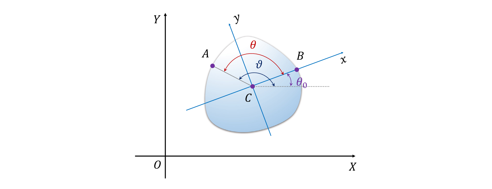
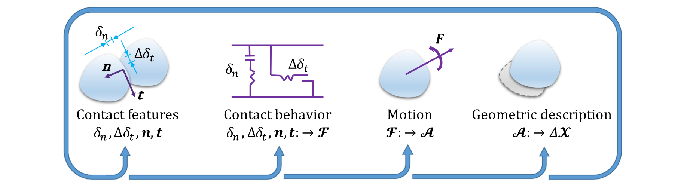

### 基于傅里叶级数的不规则粒子计算力学离散元法

论文题为**Fourier series-based discrete element method for computational mechanics of irregular-shaped particles**（*基于傅里叶级数的不规则粒子计算力学离散元法*），发表于期刊***Computer Methods in Applied Mechanics and Engineering***。*赖正首副教授*为第一作者，克莱姆森大学*陈秋实助理教授*为通讯作者。该研究受到克莱姆森大学早期探索与开发支持计划、国家自然科学基金等资助。

#### 问题描述

天然和工程材料的组成颗粒通常都是非球形的。传统的离散元方法（DEM）采用理想化形状对单个粒子进行建模，而这种简化忽略了颗粒形状对颗粒材料机械性能的影响，且可能低估了颗粒材料的强度。因此需要一个能够解释真实粒子形状的DEM模型以真实模拟和预测颗粒材料的力学行为。传统的不规则形状粒子的建模方法，受限于计算成本，且难于再现光滑的粒子情况；而用于表示粒子形状的傅里叶级数（FS）方法已被证明是一种用于描述和表征粒子形状的准确且可靠的技术，在DEM中的应用有待探索。

#### 主要创新

- 提出了基于傅里叶级数（FS）的粒子几何描述与坐标表示（图1），给出了粒子质量和惯性矩的计算表达式；陈述了粒子-粒子情况和粒子-边界两种情况下的接触检测和解析算法。

{:style="width:70%"}

图 1 不规则粒子局部与全局坐标系图

- 在上述内容基础上，开发了基于傅立叶级数的新型离散元方法 (FS-DEM)框架。介绍了包含接触特征、接触行为、粒子运动及粒子几何描述等四个关键步骤的计算流程（图2）。

{:style="width:70%"}

图 2 FS-DEM框架计算流程图

- 基于上述内容，进行如下三个数值计算：应用FS-DEM所述接触检测和接触解析算法评估放置于随机位置的两个不规则粒子之间的接触并与重叠离散元颗粒簇（ODEC）方法比较以说明其效率、开展单粒子落石试验并与商业离散元计算软件PFC比较以验证其准确性及开展固结压缩试验以证明其适用性。结果表明，FS-DEM框架准确性高、速度快，适用广。

#### 科学价值

本文开发了一种基于傅立叶级数的新型离散元方法 (FS-DEM)以计算不规则形状粒子。试验结果证明该方法稳定且计算高效，具有对不规则形状粒子系统进行计算建模的强大潜力。

##### 编辑：郭子琦