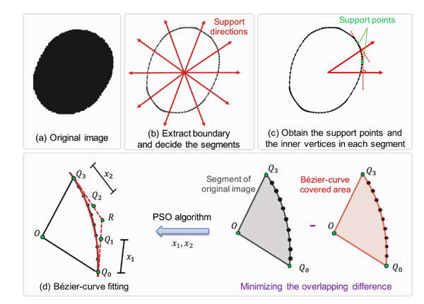
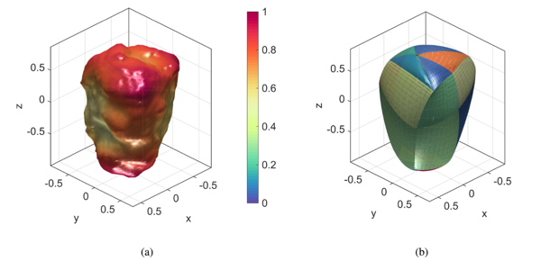

### 用于颗粒介质 DEM 建模的基于polybezier的粒子模

论文题为**A polybe  ́zier-based particle model for the DEM modeling of granular media**（*用于颗粒介质 DEM 建模的基于polybezier的粒子模型*），发表于期刊***Computers and Geotechnics***。*赖正首副教授*为第一作者，*黄林冲教授*为通讯作者。该研究收到香江学者项目、国家自然科学基金面上项目和青年项目以及深圳市自然科学基金等资助。

#### 问题描述

颗粒状材料，例如矿石、沙子和谷物等，在本质上通常是非球形的。众所周知，颗粒不规则性对颗粒介质的堆积密度、刚度和强度等宏观性质具有重大影响。实验室实验结果表明，颗粒不规则性的增加（例如，球形度/圆度的降低）将导致极端空隙率的增加、小应变刚度的降低、可压缩性的增加、增加临界状态线截距等。

离散元法(DEM)是颗粒介质建模的一个突出的数值工具，它已被用于广泛的工程学科中的许多应用。要为颗粒介质创建准确且可预测的 DEM 模型，其中的关键就是考虑颗粒形状的不规则性。

#### 主要创新

- 提出了一种基于polybezier的颗粒模型，该模型由一组bezier曲线组成，可描述光滑、不规则形状例子的DEM模型。（图1）

{:style="width:70%"}

图 1 基于bezier曲线的粒子说明图

- 通过GJK算法检测接触（图2），采用EPA算法求解接触几何特征（图3）。采用GJK和EPA组合丰富了polybezier颗粒模型与现有的其他颗粒模型在计算中的兼容性。

{:style="width:70%"}

图 2 GJK 算法说明图

{:style="width:70%"}

图 3 EPA 算法说明图

- 基于上述所提出的颗粒模型，提出了一种基于粒子群（PSO）的几何拟合程序（图4），在不同形态的颗粒中均拟合效果较好（图5）。

{:style="width:70%"}

图 4 PSO 拟合程序示意图

{:style="width:70%"}

图 5 具有不同圆度和球形特征的粒子形状的拟合示例

- 上述算法在DEM中开展随机堆积和双轴压缩数值模拟实验，计算效果较好（图6）。

{:style="width:70%"}

图 6 压缩过程结束时粒子堆积的快照：（a）非圆形颗粒和（b）圆形颗粒。红色实线代表接触力链。 Fc和Fn分别表示接触力的大小和正常接触力的平均幅度。

- 上述优化算法有从2D向3D推广的可行性。（图7）

{:style="width:70%"}

图 7 3D下粒子的示意图

#### 科学价值

本文提出了一种新的基于polybezier的粒子模型，用于描述光滑和不规则形状的DEM模型。根据该几何描述模型，提出了具有鲁棒性的接触搜索算法与几何接触特征求解算法。基于提出的PSO拟合程序可实现复杂形状颗粒的数值拟合，可为矿石、谷物等多种材料的DEM模拟前处理提供了可靠的数值工具。

##### 编辑：李诚豪