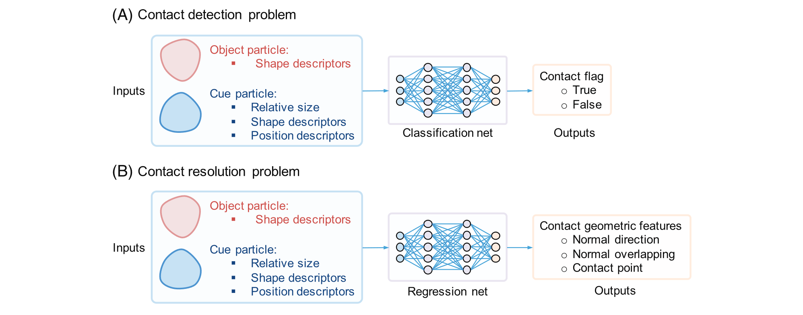
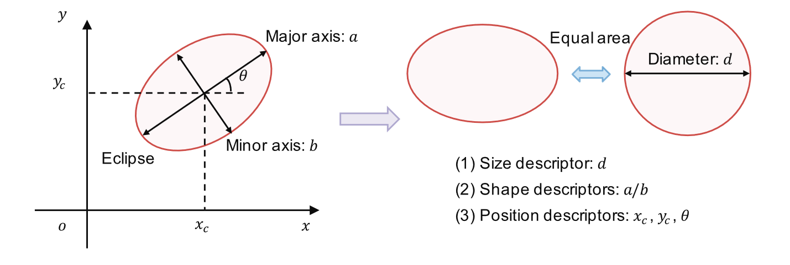

### 支持机器学习的离散元方法：不规则形状颗粒的接触检测和解析

论文题为**Machine-learning-enabled discrete element method: Contact detection and resolution of irregular-shaped particles**（*支持机器学习的离散元方法：不规则形状颗粒的接触检测和解析*），发表于期刊***International Journal for Numerical and Analytical Methods in Geomechanics***。*赖正首副教授*为第一作者，克莱姆森大学*陈秋实助理教授*为通讯作者。该研究受到香港学者计划、中央高校基本科研业务费专项资金、中国博士后科学基金、国家自然科学基金、香港研究资助局、深圳市自然科学基金、国家自然科学基金等资助。

#### 问题描述

离散元法（DEM）是一种用于不连续材料的数值方法，在诸多地质力学问题中得到广泛应用。其在一个典型的计算周期中包含接触检测与解析、接触行为评估、颗粒运动计算，以及颗粒几何描述更新等四个步骤。其中，接触检测与解析是计算周期中挑战性强、计算量最大的步骤，通常会占用DEM模拟运行时间的80%。接触检测是指识别粒子与粒子，或粒子和边界是否接触，接触解析是指解析用于评估接触力的接触几何特征。当前DEM面临两个困难，首先，现有颗粒模型仍然只涵盖了实际应用中可能遇到的各种颗粒形状的一小部分。其次，对于不规则颗粒形状，相应的接触检测和解析算法效率不高，计算时间长。

#### 主要创新

- 提出了一种机器学习框架下，使用人工神经网络（ANNs）预测DEM计算周期中第一步接触检测与解析的方法。

- 构建了分类网络和回归网络两种类型的ANNs（图1），使用分类网络用于确定接触状态，回归网络用于解析接触几何特征。其对颗粒-颗粒、颗粒-边界两种接触情况的运算性能都十分出色。

{:style="width:70%"}

图 1 分类网络和回归网络概览图，其中A分类网络，B回归网络

- 使用了大小描述符、形状描述符和位置描述符（图2）作为机器学习的输入。尺寸描述符定义为与颗粒面积相同的圆的直径，形状描述符是一组确定粒子表面的（相关形状函数的）参数，位置描述符是粒子质心的坐标以及粒子相对于其初始对齐的旋转角度。使用了颗粒-颗粒接触情况的接触位置、法线重叠长度和法线方向、颗粒-边界接触情况下的接触位置和正常重叠长度作为机器学习模型的输出。

{:style="width:70%"}

图 2 颗粒输入定义示意图

- 描述了颗粒-颗粒和颗粒-边界两种接触情况的训练数据集的生成过程。其中，一个训练样本是指一组接触情况完整的输入和输出。

- 基于上述内容，将ANNs集成到DEM中，进行单摆、斜坡落石、随机堆积、测量压缩和休止角等五个数值模拟以说明和评估所提出的支持机器学习的离散元方法的性能，这些数值模拟都使用了验证上述内容生成的椭圆粒子。最后，使用任意不规则形状的颗粒进行类似随机堆积和测量压缩的数值模拟以说明所提出的方法对于其他不规则颗粒形状的巨大潜力和适用性。

#### 科学价值

本文提出了一个基于机器学习框架，使用ANNs进行接触检测与解析的方法，介绍了用于接触检测的分类网络和用于接触解析的回归网络，确定了神经网络的输入输出，开发了生成神经网络模型的训练和测试数据库的过程。结果表明，此方法可以准确捕获单个颗粒的轨迹和能量演化、致密堆积的组构特征以及大负载下堆积的力学行为，同时拥有比传统方法更高效的计算效率。作为一个通用的DEM框架，其工作流程和实现适用于任意不规则形状颗粒，未来可应用于更广泛的数值模拟计算。

##### 编辑：郭子琦