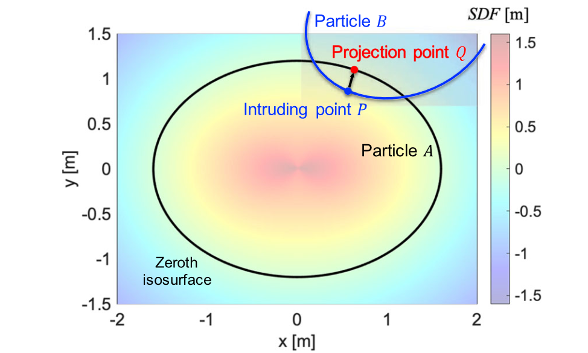
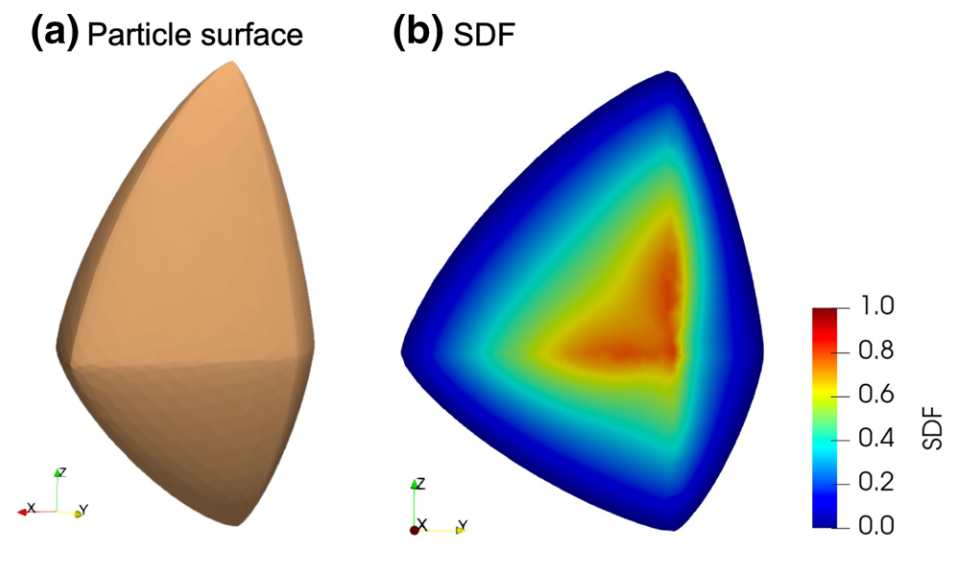
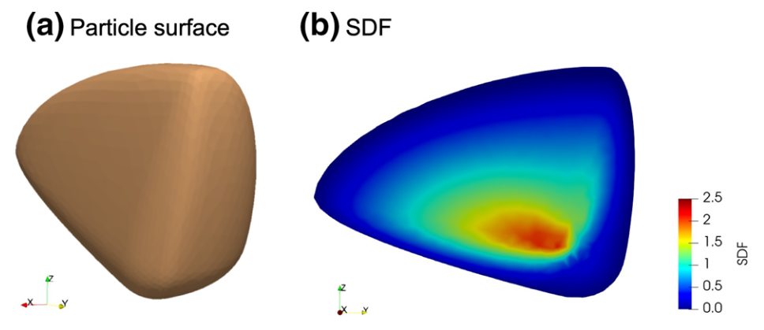
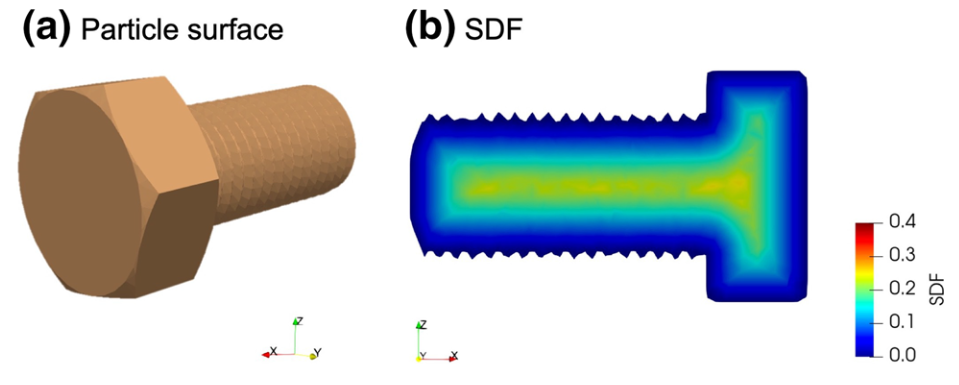
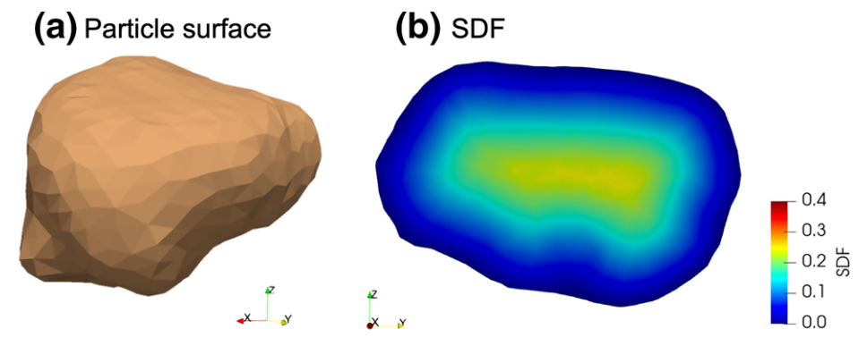
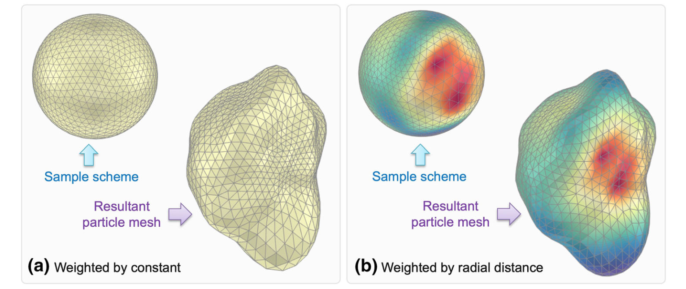
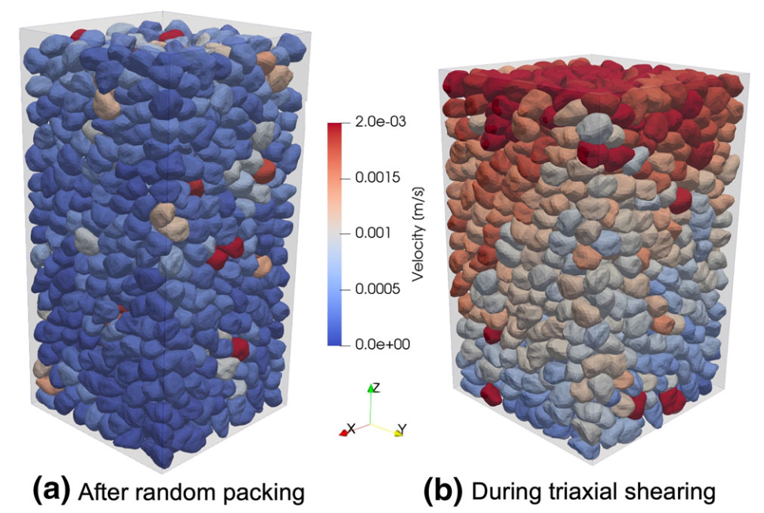
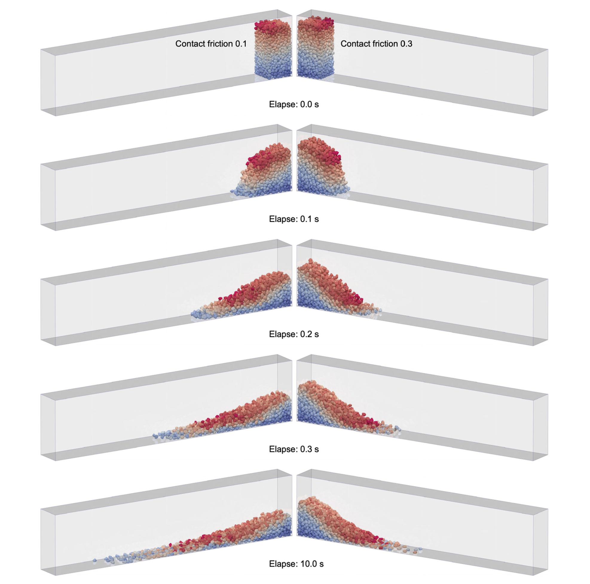
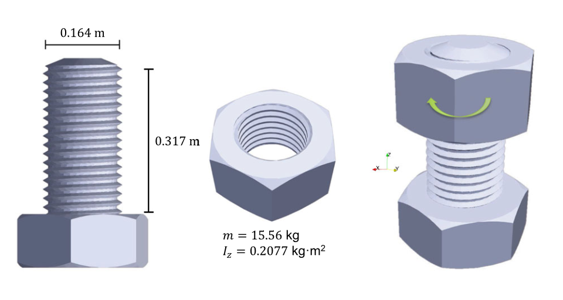

## 成果速递

### 具有任意粒子形状的粒状介质统一DEM建模的符号距离场框架

近日，*黄林冲教授* 团队在期刊***Computational Mechanics***发表了题为**Signed distance field framework for unified DEM modeling of granular media with arbitrary particle shapes**（*具有颗粒内空隙的珊瑚砂的形态特征和离散元建模*）的论文。*赖正首副教授*为第一作者，香港科技大学*赵仕威助理研究教授*为通讯作者。该研究受到香港学者计划、香港研究资助局、国家自然科学基金、广东省基础与应用基础研究基金、深圳市可持续发展科技专项、深圳市自然科学基金、河套深港科技创新合作区项目等资助。

#### 问题描述

离散元法（DEM）一直是研究粒状介质复杂行为的流行数值方法之一，近来的一个发展方向是考虑不规则颗粒形状的影响。当前，学界已有多椭球、超椭球、超二次曲面等基于不同几何形状的非球形粒子模型以更好地适应DEM建模中的形状效应。这些粒子模型的开发显著提高了DEM在模拟真实颗粒材料方面的预测能力。然而，这些不同的粒子模型的应用在很大程度上受到它们在建模特定形状类别时的特定目的的限制；一些粒子模型（例如，水平集或非凸多面体）对内存要求高、计算成本大，不适用于模拟大型颗粒系统。事实上，目前还没有一种既能够准确表示工程和工业过程中粒子的主要形状特征同时又可以提供最佳计算效率的多功能粒子模型。

#### 主要创新

- 提出了一种具有任意粒子形状的粒状介质统一DEM建模的符号距离场（SDF）框架（图1），表述了其粒子模型接口、接触算法及理论。

{:style="width:70%"}

图 1 DEM中SDF模型图

- 提供了基于上述框架的多种粒子模型，如多超椭球（图2）、多超二次曲面（图3）、球谐函数（图4）、多面体（图5）和水平集（图6）。

{:style="width:70%"}

图 2 多超椭球粒子SDF模型示例图

{:style="width:70%"}

图 3 多超二次曲面粒子SDF模型示例图

{:style="width:70%"}

图 4 球谐函数粒子SDF模型示例图

{:style="width:70%"}

图 5 多面体粒子SDF模型示例图

{:style="width:70%"}

图 6 水平集粒子SDF模型示例图

- 提出了一种基于加权球形质心 Voronoi 镶嵌 (WSCVT) 的粒子表面离散化和重建方案（图7），其可对多超椭球、多超二次曲面和球谐函数等连续函数粒子模型进行接触检测，可用于获得任意数量的表面点，并提供了一种控制点局部密度的新方法。

{:style="width:70%"}

图 7 基于WSCVT的粒子表面点采样示意图，其中（a）依常数加权、（b）依径向距离加权

- 基于上述内容，在DEM中开展随机填充（图8-a）、柱坍塌（图9）、螺母旋入螺栓（图10）、三轴压缩（图8-b）数值模拟试验。讨论了不同粒子模型的内存消耗和计算效率。结果表明，多面体粒子模型在再现复杂形状方面具有相当的灵活性，而水平集粒子模型具有最高的计算效率，但可能会消耗大量内存。多超椭球、多超二次曲面和球谐粒子模型对内存相当友好，并呈现中等计算性能。

{:style="width:70%"}

图 8 1250个颗粒组成构型数值模拟图，其中（a）随机填充、（b）三轴压缩

{:style="width:70%"}

图 9 柱坍塌数值模拟图

{:style="width:70%"}

图 10 螺母旋入螺栓数值模拟草图

#### 科学价值

本文提出了一个统一的基于SDF框架，用于DEM中任意形状粒子之间的接触检测和解析，并使用经典几何学开发了说明性的粒子模型，如多椭球、超椭球、超二次曲面、球谐函数、多面体和水平集，集成到此框架中。数值模拟试验结果表明，此框架是一种很有前途的通用替代方案，可以在 DEM中准确高效地模拟任意形状的粒子（特别是非凸粒子）。为对模拟性能有更高要求的用户提供了可行方法。

##### 编辑：郭子琦