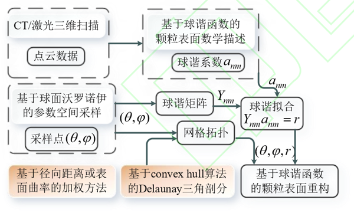
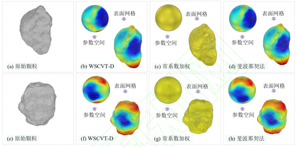
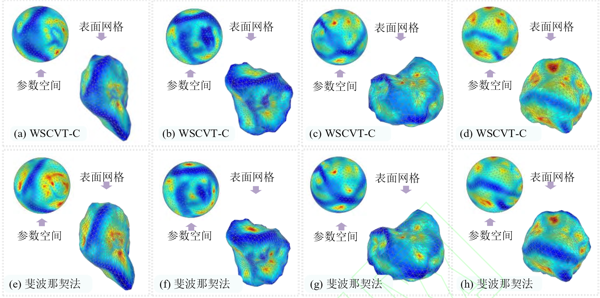
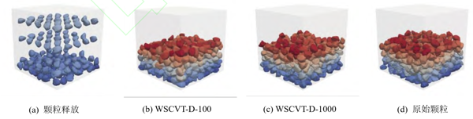
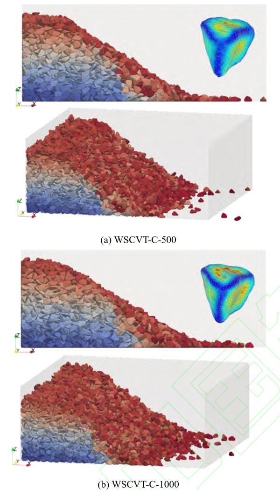

## 基于球面沃罗诺伊的颗粒表面离散与重构方法

近日，*黄林冲教授* 团队在期刊***工程力学***发表了题为**基于球面沃罗诺伊的颗粒表面离散与重构方法**的论文。*吴峰硕士*为第一作者，*赖正首副教授*为通讯作者。该研究受到国家自然科学基金、国家自然科学基金国际(地区)合作与交流项目等资助。

#### 问题描述

颗粒表面离散或重构通常在岩土颗粒材料的微观重构、可视化或离散元方法（DEM）等数值模拟中涉及。颗粒表面离散通过将颗粒表面采用球坐标参数化，进而采用一定的参数抽样及拓扑规则得到多边形网格实现，最后重构颗粒材料表面形态。需要注意的是，不同的应用场景可能需要不同的颗粒表面网格特征，目前的常用方法行至参数空间上的网格映射到物理空间一步时往往会出现畸变，难以实现对于局部点云密度的有效控制。

#### 主要创新

- 提出了一种基于球面沃罗诺伊、球谐函数及计算机断层扫描的岩土颗粒表面离散与重构方法（图1）。其可以用来获得任意数量的表面点，并简化网格分布较密、节点数量较多的颗粒表面。

{:style="width:70%"}

图 1 颗粒表面重构流程图

- 提出了基于表面点径向距离（WSCVT-D）和基于表面点曲率（WSCVT-C）的两种加权公式以适应不同网格特征的需要。WSCVT-D方法可以避免现有斐波那契法等在参数空间映射到颗粒表面空间时发生的网格畸变问题（图2），WSCVT-C方法可以较快地收敛于CT数据得到的原始颗粒的形状表征参数（图3）。

{:style="width:70%"}

图 2 不同采样方法下的颗粒表面重构对比图（其中颗粒的颜色表示径向距离）

{:style="width:70%"}

图 3 基于 WSCVT-C 重构颗粒表面图

- 基于上述所提出的方法，在DEM中开展自然堆积（图4）、抛石防波堤实验（图5），结果良好。证明了此方法应用于颗粒表面离散与重构的有效性与准确性，其可以简化复杂的表面网格、减少颗粒表面节点，同时保证形状参数的误差在较小的范围，显著减少离散元模拟的时间成本，而不影响最终模拟结果。

{:style="width:70%"}

图 4 颗粒材料自然堆积离散元模拟图

{:style="width:70%"}

图 5 抛石防波堤离散元模型图

#### 科学价值

本文提出了一种基于球面沃罗诺伊和球谐函数的表面离散与重构方法，并给出了基于径向距离和基于曲率的两种权重函数，有效地降低了离散元模拟的计算复杂性，为离散元模拟于大型工程的应用提供了一种颗粒简化的合理方法。

##### 编辑：郭子琦
