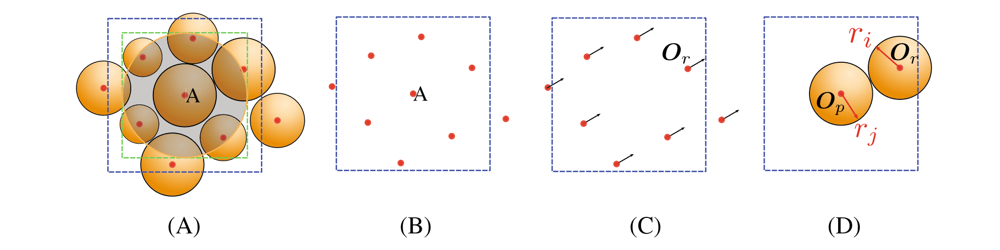
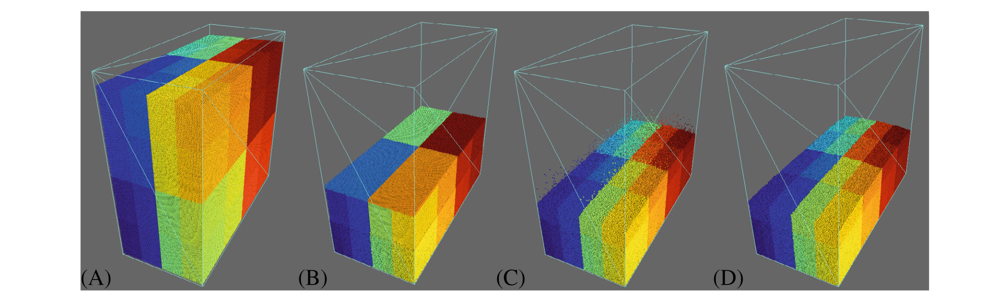

### 利用光线追踪核心在 GPU 上进行基于粒子的模拟

论文题为**Leveraging ray tracing cores for particle-based simulations on GPUs**（*利用光线追踪核心在 GPU 上进行基于粒子的模拟*），发表于期刊***International Journal for Numerical Methods in Engineering***。香港科技大学*赵仕威助理研究教授*为第一作者，*赖正首副教授*为通讯作者。该研究受到国家自然科学基金、广东省基础与应用基础研究基金、香港研究资助局和河套深港科技创新合作区项目等资助。

#### 问题描述

如离散元方法 (DEM)、分子动力学 (MD)、近场动力学 (PD) 和光滑粒子流体动力学 (SPH) 等基于粒子的数值方法，因其无网格和高度可并行化的特点而在研究和工程应用中愈加受到欢迎。对于此类数值方法，粒子的运动取决于其与周围粒子（邻居）的相互作用，是以粒子的邻域搜索为关键一步。邻域搜索计算量大、现有方法用时长，需要开发新的算法，加速计算、减少用时。

#### 主要创新

- 提出了一种基于光线追踪（RT）的邻域搜索算法，并以基于单元的算法为基准。此算法利用了NVIDIA光线追踪核心，通过OptiX采用了最先进的BVH算法。

{:style="width:70%"}

图 1 邻域搜索问题转化光线追踪问题示意图

{:style="width:70%"}

图 2 具有两个物理单元的NVIDIA光线追踪核心（A）及OptiX7中常见光线追踪工作流程（B）图

- 验证了基于RT的邻域搜索算法于基于GPU的DEM代码中的应用和实现。

{:style="width:70%"}

图 3 基于GPU的DEM工作流程伪代码图

- 基于上述内容，在DEM展开颗粒堆积、柱体坍塌和干泥石流数值模拟试验，以评估所提出的基于RT的算法相对于传统的基于单元的算法的计算性能。结果表明，前者可以比后者快大约10%∼60%，所需内存几乎一致。对于可以最大程度利用光线追踪核心的大型粒子系统和动态问题，性能增益可能更为显着。

{:style="width:70%"}

图 4 颗粒堆积数值模拟图，其中(A)t=0s、(B)t=2s、(C)t=4s、(D)t=40s

{:style="width:70%"}

图 5 柱坍塌数值模拟图，其中你（A）初态、（B）终态

{:style="width:70%"}

图 6 干泥石流数值模拟图，其中（A）地形及滑动面、（B）放大滑动面

#### 科学价值

本文提出了一种提出了用于基于粒子的数值方法的基于RT的邻域搜索算法，相较于传统的基于单元的邻域搜索算法快10%∼60%，具体取决于模拟的问题和 GPU 规格，为使用基于粒子的数值方法对大规模工程问题进行下一代高性能计算提供了新方法。

##### 编辑：郭子琦
