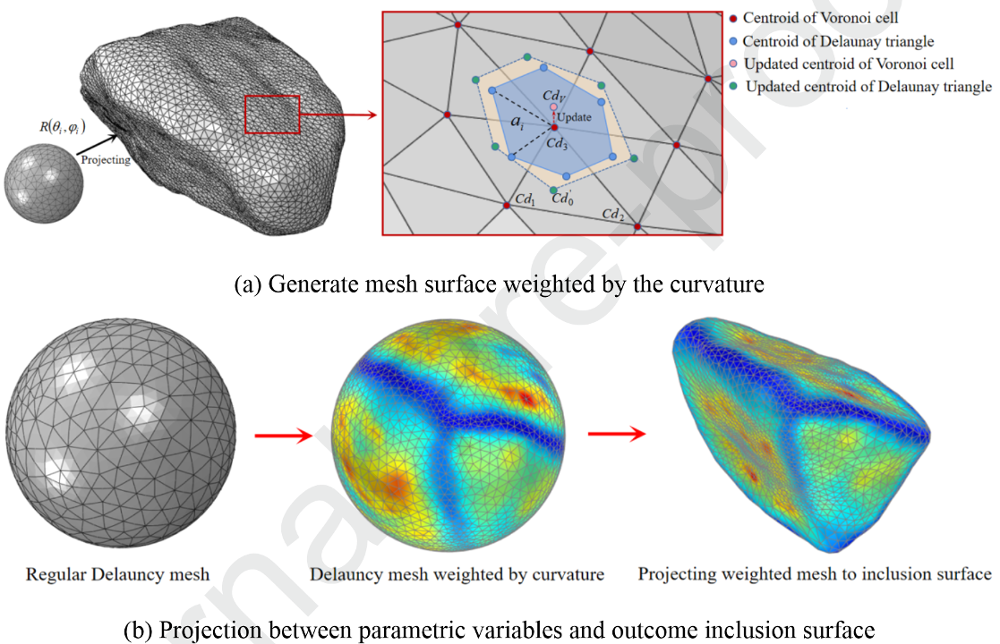

### 

### 一种使用新颖重建策略研究含有随机夹杂物岩土材料的力学性质与断裂特性的FDEM方法

近日，*教授* 团队在期刊***Engineering Fracture Mechanics***发表了题为**A FDEM approach to study mechanical and fracturing responses of geo-materials with stochastic inclusions using a novel reconstruction strategy**（*一种使用新颖重建策略研究含有随机夹杂物岩土材料的力学性质与断裂特性的FDEM方法*）的论文。*赖正首副教授*为，*黄林冲教授*为。该研究受到国家自然科学基金和中国基础研究项目等资助。

#### 问题描述

含有不规则夹杂物的异质岩土材料在自然界中含量丰富，分布广泛，受到大量研究。传统的试验方法无法明确观察到非均质岩石的微观力学行为和破坏特征，现有的数值方法或难于定义近似空间的富集（FEM、XFEM），或没有考虑形状效果（DEM、DDA），或受限于网格数量和质量（FDEM），尚缺乏界面性质对力学力学性质和断裂特性影响的系统研究。

#### 主要创新

- 采用了一种基于曲率加权球面Voronoi（CWSVM）的几何计算方法的表面重建方法（图1），可以在保留主要形状特征的同时有效地细化夹杂物几何形状。CWSVM可以很好地控制网格数量和质量（图2）。

{:style="width:70%"}
Fig. 1: Detailed strategy of the CWSVM.

##### 图2

- 采用了一种基于符号距离场离散元方法 (SDF-DEM)的夹杂物分配算法生成具有受控特征的3D异质模型（图3）。SDF-DEM能够有效且高效地生成随机数值模型，特别是对于包含大量夹杂物的情况（图4）。

##### 图3

##### 图4

- 基于上述内容，将内聚单元集成到网格中生成FDEM数值模型（图5），将含夹杂物异质材料的模拟力学和断裂行为与实验结果进行比较验证。数值计算结果与实验结果吻合良好（图6）。使用所提出的FDEM模型以比其他方法更少的计算时间和更低的成本实现了令人满意的计算精度。此外，提出了一种组合本构模型来考虑内聚单元的剪切硬化行为（图7）。 

##### 图5

- 讨论了界面强度对异质岩土材料力学性质的影响。当夹杂物与基体界面结合得当时，力学性能一般随夹杂物含量的增加而提高，然而，当界面强度小于基体强度的60%时，观察到相反的趋势（图8）。此外，随着界面强度的增加，内聚力和内摩擦角呈现出相反的发展趋势（图9、图10）。
  

- 讨论了界面强度对异质岩土材料断裂特性的影响。增加界面强度显着提高了硬质夹杂物的失效比例，特别是在高围压和夹杂物分数的情况下（图11）。此外，相当一部分夹杂物和界面处的失效是由拉应力引起的（图12），这表明硬质夹杂物的抗拉强度是决定含夹杂物材料力学性能的关键参数。

#### 科学价值

  - 本文提出了一种基于FDEM的数值方法，用于模拟具有不规则夹杂物的异质岩土材料的力学和断裂行为。该方法的夹杂物表面形貌首先通过3D扫描技术获得。采用基于CWSVM的方法来控制网格数量和质量，采用基于SDF-DEM的算法近似夹杂物的自然分布和方向。通过这种数值方法可以有效且高效地生成具有大量夹杂物（例如 60% 和 70%）的非均质岩土材料，为具有不规则夹杂物的岩土材料的力学性质研究提供了可靠的数值工具。

##### 编辑：

