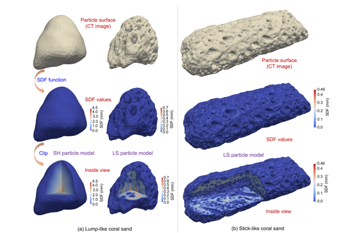

## 具有颗粒内空隙的珊瑚砂的形态特征和离散元建模

近日，*黄林冲教授* 团队在期刊***Engineering Geology***发表了题为**Morphology characterization and discrete element modeling of coral sand with intraparticle voids**（*具有颗粒内空隙的珊瑚砂的形态特征和离散元建模*）的论文。*黄帅博士*为第一作者，*赖正首副教授*为通讯作者。该研究收到香港学者计划、国家自然科学基金、深圳市可持续发展科技计划、深圳市自然科学基金、河套深港科技创新合作区项目、香港研究资助局等资助。

#### 问题描述

珊瑚砂是一种特殊类型的岩土材料，主要由珊瑚的代谢产物（如碳酸钙）和骨骼经过海浪的复杂机械过程形成。与陆源石英砂相比，其组成颗粒形状复杂，颗粒内空隙丰富。随着在热带岛屿和珊瑚礁上建设基础设施的需求不断增长，学界对珊瑚砂力学及工程特性的研究不断增加。当前，开发用于珊瑚砂形态表征的工作流程和数值建模的工具对于珊瑚砂在工程中进一步开发应用至关重要。

#### 主要创新

- 提出了一种基于CT图像重建颗粒形态，进而使用纵横比、球形度和圆度三种形态描述符量化颗粒形态的珊瑚砂形态表征工作流程（图1）。

{:style="width:70%"}

图 1 图像处理过程（a）及由表面三角网格表示最终重建颗粒（b）图

- 提出了一种提出适用于任意不规则形状颗粒的基于符号距离场的离散元方法（SDF-DEM）。SDF-DEM能兼顾珊瑚砂颗粒的不规则形状和颗粒内空隙；讨论了均适用于珊瑚沙的球谐函数（SH）和水平集（LS）两种颗粒模型（图2），其中SH已广泛应用于三维不规则星形颗粒建模，LS可以高保真地捕获珊瑚砂的颗粒内空隙。

{:style="width:70%"}

图 2 基于SDF的SH粒子模型（a）及LS粒子模型（b）图

- 提出了基于RF-SH的虚拟珊瑚砂颗粒生成方法（图3），进一步提出了棒状颗粒的生成方法（图4），证明了RF-SH颗粒生成方法在虚拟珊瑚沙颗粒生成方面高度有效。

{:style="width:70%"}

图 3 细长粒子SH收缩策略模拟图

{:style="width:70%"}

图 4 块状珊瑚砂颗粒（a）及棒状珊瑚砂颗粒（b）SDF可视化图

- 讨论了SH和LS两种颗粒模型的准确性。其中，SH颗粒模型可用于高度不规则形状的珊瑚砂建模；LS颗粒模型可合理地捕捉颗粒内空隙（图5）。

{:style="width:70%"}

图 5 SH粒子和LS粒子之间差异及内部空隙微观结构图

- 基于上述内容，在DEM中开展珊瑚沙颗粒柱坍塌数值模拟试验并与实验结果进行比较验证（图6），吻合良好；证明了不涉及破损的情况下，颗粒内空隙对珊瑚砂的力学行为的影响可以忽略不计由此可得SH可用于模拟珊瑚砂以提高计算效率和节省内存。

{:style="width:70%"}

图 6 珊瑚沙颗粒柱坍塌数值模拟试验图

#### 科学价值

本文提出了一种珊瑚砂形态表征工作流程及一种DEM的珊瑚砂数值模型。未来可以此为工具，研究珊瑚砂在具有更复杂环境和载荷条件的实际问题（例如侵蚀和扩散）中的力学行为。

##### 编辑：郭子琦
